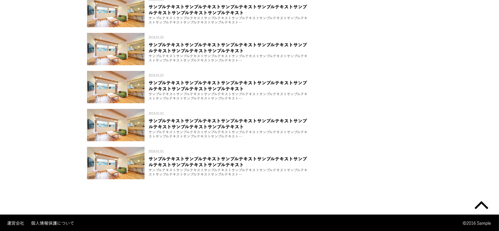
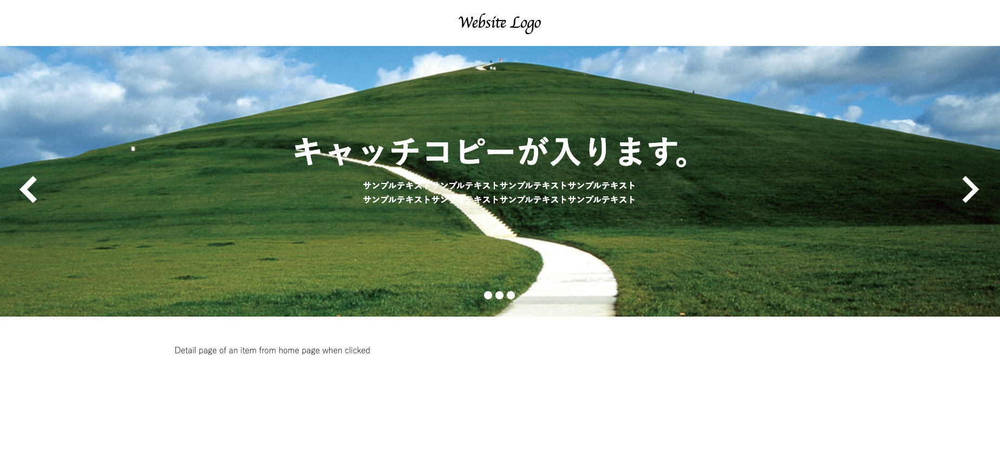
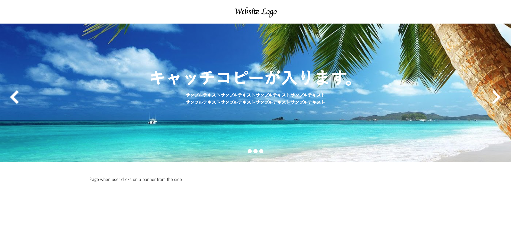

This project was generated with [Angular CLI](https://github.com/angular/angular-cli) version 8.3.2.

## 1. Install Dependencies

Get into the project folder `lig-frontend`.

Assuming Node is already installed in your pc, download the project's dependencies with `npm install`

## 2. Development Server

Run `ng serve` for a dev server. Navigate to `http://localhost:4200/`. The app will automatically reload if you change any of the source files.

If error occurs upon running `ng serve`, proceed to step number 3

## 3. Installation of Angular CLI

Input the command `npm install -g @angular/cli` to install Angular CLI. If further errors occur, install its dependencies depending on the error

